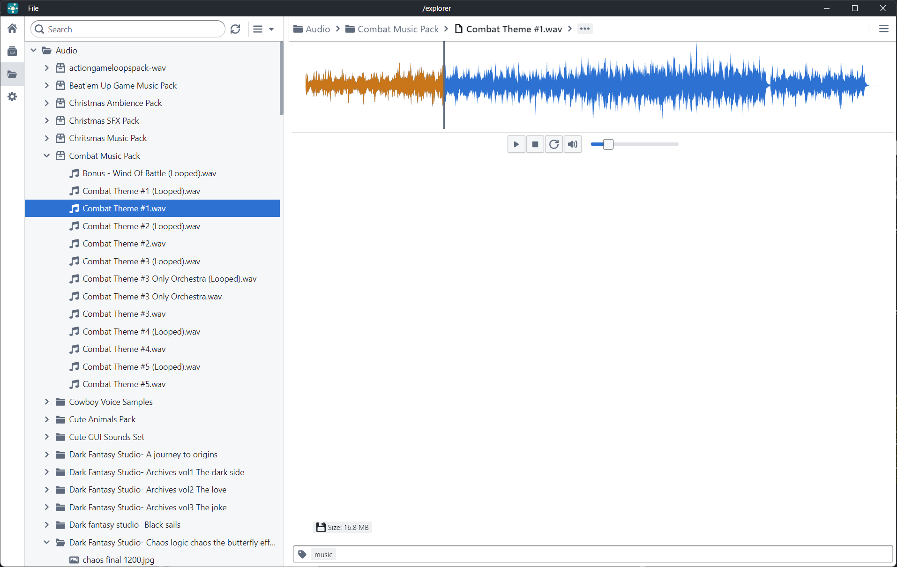
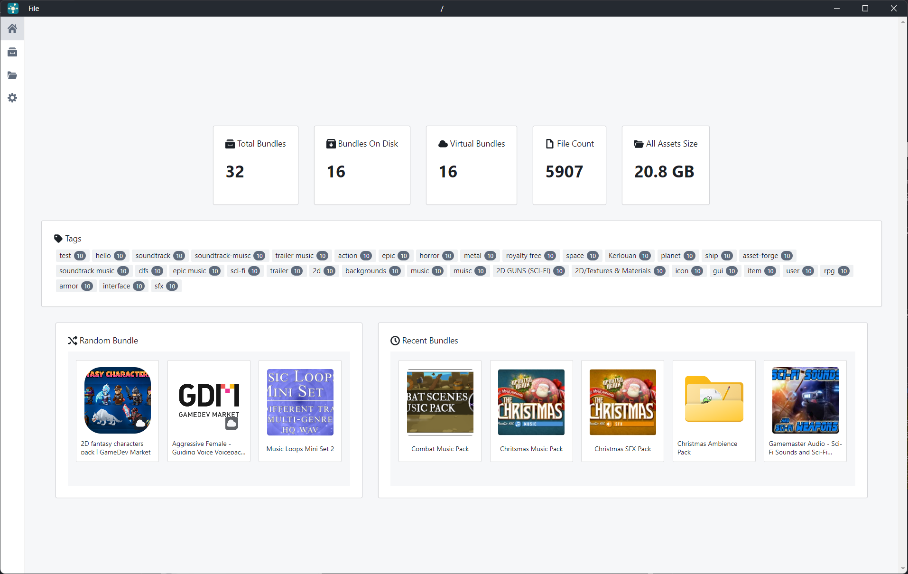

# Electron Digital Asset Manager (Electron DAM)
 
## Project
A bundle based digital asset manager built on top of electron using React and typescript.
Based on the [Electron React Boilerplate](https://github.com/electron-react-boilerplate/electron-react-boilerplate)

I created this app because I got to a point where I had a ton of assets accumulated from asset packs, and I wanted a way to quickly view and manage those assets without having to import them into a game engine or fiddle around with them in the windows explorer. I also made it a lot easier to search for specific assets based on semantics so I can discover the right assets for my needs. Quick music preview as also a big thing, I wanted to quickly listen to lots of music similar to sites like [freesound.org](https://freesound.org/). Most features either depend on the file system and meta files, or human readable json databases so that tool change is low friction. This also hopefully avoids data loss and external or network storage can easily be utilized.

## Features
* 3D Model Preview of multiple formats
* Can handle large libraries
* Audio Preview with visualization
* Easy Metadata Fetching with Ollama support
* Light/Dark Mode using [Blueprint JS](https://blueprintjs.com/)
* Tagging
* Metadata Generation/Extraction with Ollama support
* Advanced searching and filtering including Semantic Search
* Stats and sorting
* Virtual Bundles
* Compressed bundle Support
* Asset exporting

## Supported formats
* 3D Models: (obj, fbx, gltf, stl)
* Audio: (mp3,flac,wav,ogg)
* Images: (png, jpg, gif, svg, apng,ico, bmp, webp)
* Text: (txt, md)

## How To Use
I keep a minimal [wiki](https://github.com/simeonradivoev/electron-dam/wiki) as most features I've tried to make evident as much as I can in the UX or by adding tooltip all over the place.

## Roadmap
You can check the [Enchantments](https://github.com/simeonradivoev/electron-dam/issues?q=is%3Aissue%20state%3Aopen%20label%3Aenhancement) but mostly I add things I find useful or missing. I am more of a hands off person as I have lots of active projects, so I may not be consistent but I did try and make the asset management be file based avoiding losses on tool change. 

## Screenshots

### Dark Mode

## 🔩 Technology Stack
* [ASSIMP](https://github.com/assimp/assimp)
* [Three.js](https://github.com/mrdoob/three.js/)
* [Electron](https://github.com/electron/electron)
* [React](https://github.com/facebook/react)
* [Blueprint.js](https://github.com/palantir/blueprint)
* [Wavesurfer.js](https://wavesurfer-js.org/)
* [React Query](https://github.com/tanstack/query)
* [React Virtual](https://github.com/tanstack/virtual)
* [Headless Tree](https://github.com/lukasbach/headless-tree)
