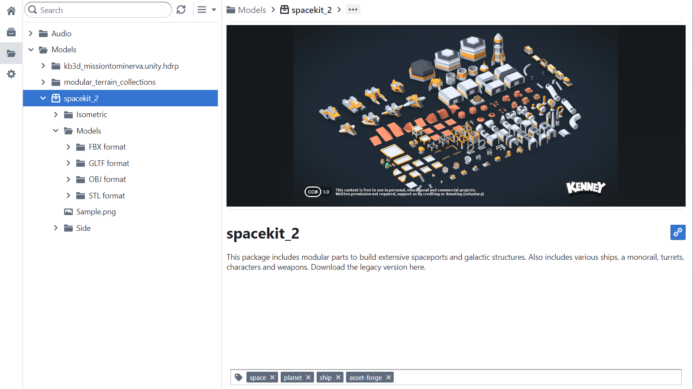
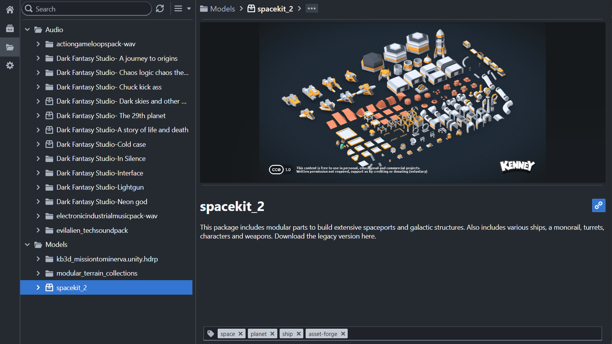

# Electron Digital Asset Manager (Electron DAM)
 
## Project
A bundle based digital asset manager built on top of electron using React and typescript.
Based on the [Electron React Boilerplate](https://github.com/electron-react-boilerplate/electron-react-boilerplate)

I created this app because I got to a point where I had a ton of assets accumulated from asset packs, and I wanted a way to quickly view and manage those assets without having to import them into a game engine or fiddle around with them in the windows explorer.

>⚠️This is an early alpha version with bare bone features, there might be bugs and performance issues.

## Features
* 3D Model Preview
* Audio Preview
* Easy Metadata Fetching
* Light/Dark Mode using [Blueprint JS](https://blueprintjs.com/)
* Tagging
* Searching and Filtering
* Homepage with stats
* Virtual Bundles

## Supported formats
* 3D Models: (obj, fbx, gltf, stl)
* Audio: (mp3,flac,wav,ogg)
* Images: (png,jpg,gif,svg,apng,ico)
* Text: (txt,md)

## Screenshots

### Dark Mode

## 🔩 Technology Stack
* [ASSIMP](https://github.com/assimp/assimp)
* [Three.js](https://github.com/mrdoob/three.js/)
* [Electron](https://github.com/electron/electron)
* [React](https://github.com/facebook/react)
* [Blueprint.js](https://github.com/palantir/blueprint)
* [Wavesurfer.js](https://wavesurfer-js.org/)
